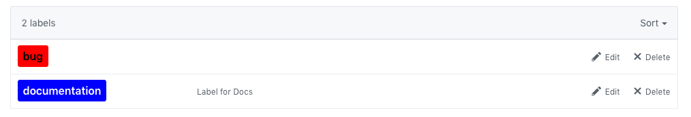

# Issue Label Manager CLI

Node CLI to declaratively setup labels across GitHub repos

## Setup

First, clone this repo down:

```
git clone https://github.com/lannonbr/issue-label-manager-cli
```

You'll need a Personal access token from GitHub that has permissions to overwrite labels on the repos you want to use this on.

Next, save the token in a .env file as GITHUB_TOKEN

```
GITHUB_TOKEN=<secret_token>
```

## Usage

First, write up a JSON file with the following schema:

```json
[
  { "name": "documentation", "color": "0000ff", "description": "Label for Docs" },
  { "name": "bug", "color": "ff0000" }
]
```

Each entry requires a name and hex code color. The description is optional

To run the CLI, run the following command.

```
node index.js <pathToLabelsJSON> <owner> <repo>
```

So If I want to say overwrite the labels on say this repo where I have a labels.json file stored in the root of this project, I would run

```
node index.js labels.json lannonbr issue-label-manager-cli
```

It will provision the labels up to the repos as such:



## WARNING

The CLI currently will overwrite the labels on the repo you apply this to so it removes any label that is not in the JSON file. A future update will allow this to be optional.

## Related Projects

- [lannonbr/issue-label-manager-action](https://github.com/lannonbr/issue-label-manager-action): a GitHub Action that does this in an automated workflow.